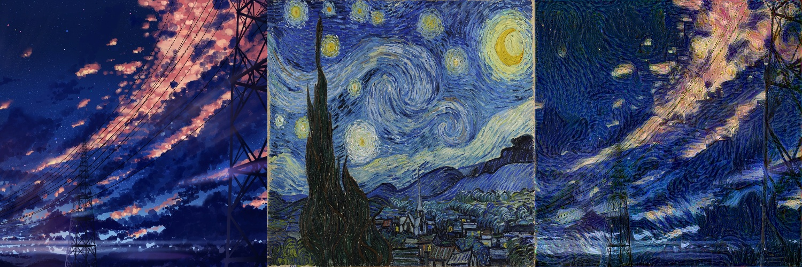
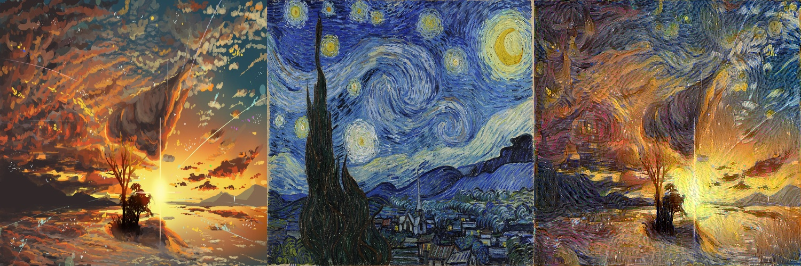

# Style Transfer

风格迁移的一些demo。

## 迭代生成

```shell
python3 model/optimize_style_transfer.py -s sample/starry_night.jpg -c sample/paint.jpg -o result.jpg --stack_output result_stack.jpg --step 500
```




> Notice: 虽然全卷积使得模型支持任意大小的输入，但是过大的输入尺寸会耗尽内存。所以为了您的人生安全，请务必理性设置图像尺寸。
